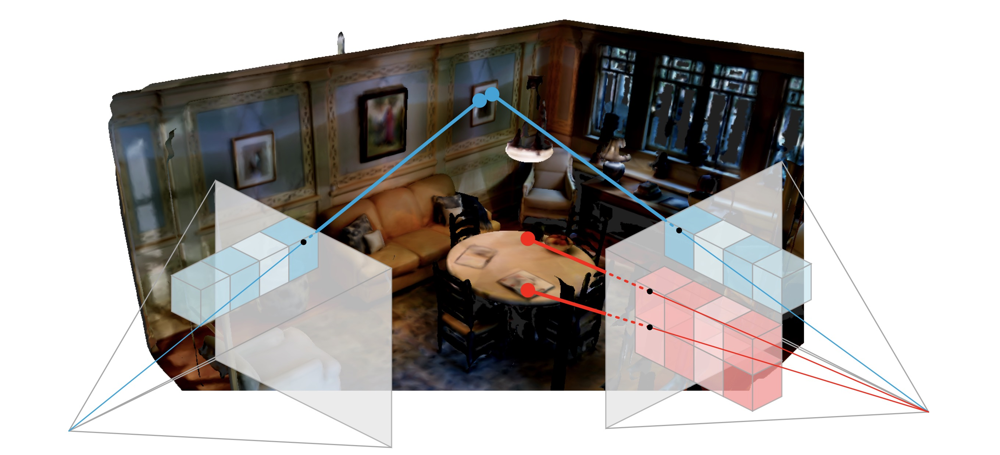

# LoCo

Code for the NeurIPS 2024 paper ["LoCo: Learning 3D Location-Consistent Image Features with a Memory-Efficient Ranking Loss"](https://www.robots.ox.ac.uk/~vgg/research/loco)



## Data

The data used to train the LoCo model is the [Matterport3D](https://niessner.github.io/Matterport/) dataset.

### Data Preparation

1. Download the dataset using the instructions on the [dataset website](https://niessner.github.io/Matterport/) for Matterport3D.
2. Run the `scripts/dataset_preparation_scripts/run_matterport3d_pipeline.sh` script. If more control is required, change the arguments of the Python scripts called or the Python scripts directly.

To prepare the ScanNet dataset for training (not done to obtain the results in the paper), download the [Scannet](http://www.scan-net.org) dataset and run the `scripts/dataset_preparation_scripts/run_scannet_pipeline.sh` script.

## Training the model

To train the model, run `train.py` with the desired configuration files and command line options. Some default configurations can be found in the `config` folder.

## Testing the model

To train the model, run `test.py` with the desired configuration files and command line options. Some default configurations can be found in the `config` folder.

To test on the Pixel Correspondence task, download the [Scannet](http://www.scan-net.org) dataset. To test on VPR tasks, download the desired VPR datasets (see `src/data/vpr_datasets`).

## Pre-Trained Weights

We release pre-trained weights for our model at [this](https://drive.google.com/drive/folders/15eFhJ7CrKWM_LgjojSjGvQBABZ4dGyXy?usp=share_link) link.
The model is trained using the settings described in the paper. For detailed results, please refer to the ablation study in the paper.

After downloading a file from one of the links, the path to that file can be used as the `+ckpt_path` argument in the `train.py` and `test.py` scripts.

## Paper

If you find this work useful, please consider citing:

```bibtex
@InProceedings{Kloepfer_2023_ICCV,
    author = {Kloepfer, Dominik A. and Henriques, Jo\~{a}o and Campbell, Dylan},
    title = {LoCo: Learning 3D Location-Consistent Image Features with a Memory-Efficient Ranking Loss},
    booktitle = {Advances in Neural Information Processing Systems},
    pages = {124391--124419},
    volume = {37},
    year = {2024}
    editor = {A. Globerson and L. Mackey and D. Belgrave and A. Fan and U. Paquet and J. Tomczak and C. Zhang},
    publisher = {Curran Associates, Inc.},
}
```
